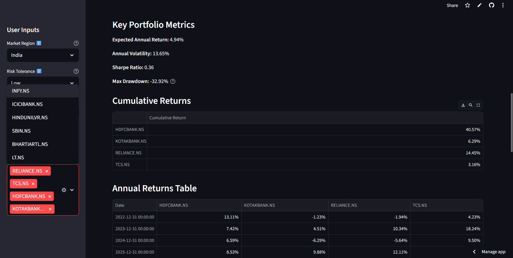

# Robo-Advisor: Portfolio Optimization Tool

A beginner-friendly web application for portfolio optimization, focused on Indian stocks. Built with Python, Streamlit, Pandas, NumPy, SciPy, and PyPortfolioOpt.

## Features
- Input risk tolerance (low, medium, high)
- Input initial investment amount
- Select Indian stocks from a dropdown or upload a CSV of tickers/weights
- Portfolio optimization using Mean-Variance Optimization and Sharpe ratio maximization
- Visualizations: allocation pie chart, return vs risk scatter plot
- Key metrics: Sharpe ratio, volatility, expected annual return, max drawdown
- Sector breakdown pie chart
- Export optimized portfolio as CSV
- Tooltips for financial terms
- Beginner-friendly, clean UI

## Screenshots

<p align="center">
  
</p>

<p align="center">
  
</p>

<p align="center">
  
</p>

<p align="center">
  
</p>


## How to Run Locally
1. **Clone the repository:**
   ```
   git clone <your-repo-url>
   cd <project-folder>
   ```
2. **Install dependencies:**
   ```
   pip install -r requirements.txt
   ```
3. **Start the app:**
   ```
   streamlit run app.py
   ```
4. **Open your browser:**
   Go to `http://localhost:8501` to use the app.

## Deployment Options
### Streamlit Community Cloud (Recommended for Streamlit apps)
- Go to [https://streamlit.io/cloud](https://streamlit.io/cloud)
- Sign in and click 'New app'.
- Connect your GitHub repo and select the branch and `app.py` as the entry point.
- Click 'Deploy'.
- The app will be live on a public URL.


## Project Structure
```
├── app.py                # Main Streamlit app
├── requirements.txt      # Python dependencies
├── README.md             # Project documentation
└── .github/
    └── copilot-instructions.md
```

## Data & Privacy
- All financial data is fetched using yfinance and is for educational purposes only.
- No user data is stored.

## Contributing
Pull requests are welcome. For major changes, please open an issue first to discuss what you would like to change.


## Acknowledgements
- [Streamlit](https://streamlit.io/)
- [PyPortfolioOpt](https://pyportfolioopt.readthedocs.io/)
- [yfinance](https://github.com/ranaroussi/yfinance)
- [Pandas](https://pandas.pydata.org/)
- [NumPy](https://numpy.org/)
- [Plotly](https://plotly.com/python/)
